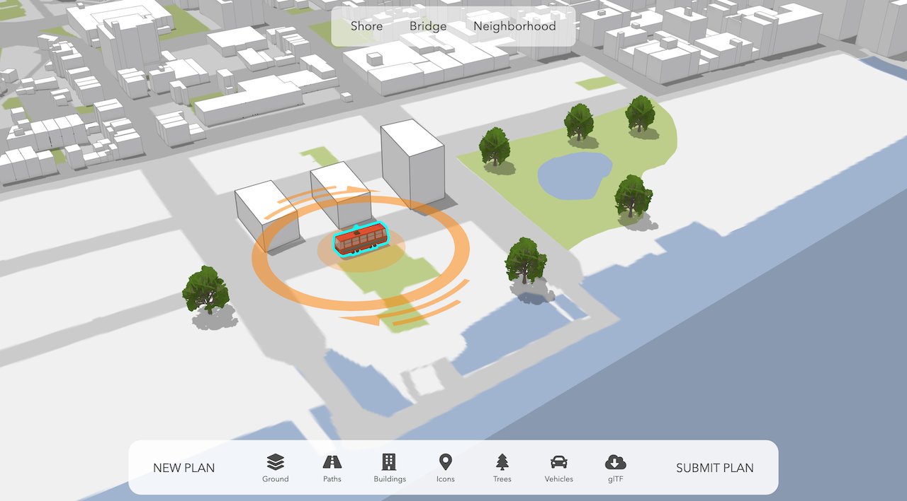

# Совместное планирование

Интерактивное 3D-веб-приложение, позволяющее горожанам заниматься городским планированием с помощью [ArcGIS API for JavaScript](https://developers.arcgis.com/javascript/). Первоначальный проект был позаимствован с репозитория [arnofiva/construction-site-planning](https://github.com/arnofiva/construction-site-planning). И далее изменён мною под город Астана.

[](https://esri.github.io/participatory-planning)

Приложение использует различные функции API, такие как [3D-рисование](https://developers.arcgis.com/javascript/latest/api-reference/esri-widgets-Sketch.html), [импорт glTF](https://developers.arcgis.com/javascript/latest/sample-code/import-gltf/index.html) и [фильтрация на стороне клиента](https://developers.arcgis.com/javascript/latest/api-reference/esri-views-layers-support-FeatureFilter.html).

С технической стороны приложение построено с использованием [TypeScript](https://www.typescriptlang.org/), [npm](https://www.npmjs.com/) и [webpack](https://webpack.js.org/).

## Инструкции

Проект, который модифицирован под Астану использует данные с сайта ArcGIS Enterprise, который развернут и запущен в компании KazAeroSpace. Следовательно проект не будет работать у вас и будет требовать авторизации. Пока можете смотреть внизу первоначальный проект, который сделал Arno Fiva.

Живая версия доступна [здесь](https://esri.github.io/participatory-planning).

Чтобы запустить исходный код локально, выполните следующие действия:

```
git clone https://github.com/Esri/participatory-planning.git
cd participatory-planning/
npm install
npm run start # serves application at http://localhost:8080
```
